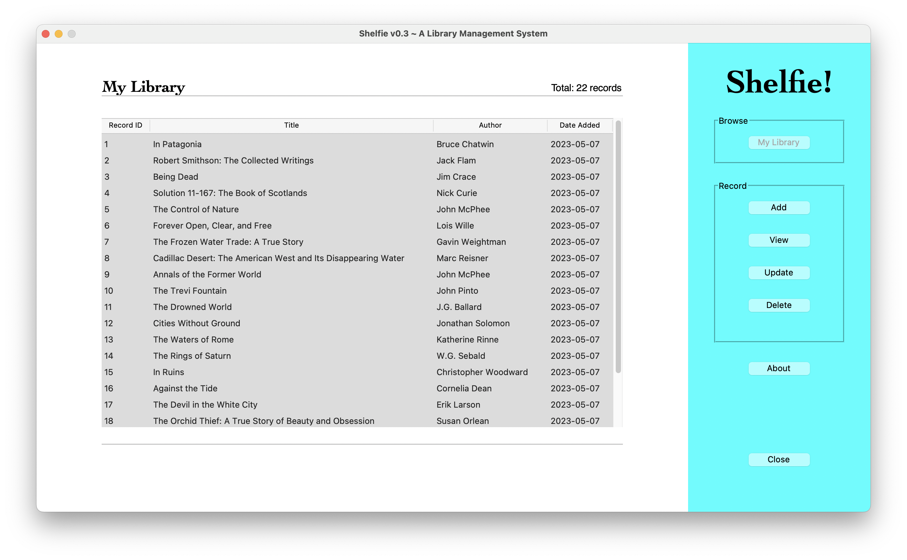

# Shelfie

A Library Management System developed using tkinter in Python

## Table of Contents

> [!NOTE]
> ALL CONTENTS IN THIS REPO ARE FOR EDUCATIONAL PURPOSES ONLY.

* [Description](#description)
* [Target Users](#target-users)
* [Features](#features)
* [Project Structure](#project-structure)
* [Quick Start](#quick-start)
* [Local Setup](#local-setup)
  * [Prerequisites](#prerequisites)
  * [Dependencies](#dependencies)
  * [Installation](#installation)
  * [Configuration](#configuration)
* [Usage](#usage)
* [Production Setup](#production-setup)
* [System Administration](#system-administration)
* [Author(s)](#authors)
* [Version History](#version-history)
  * [Release Notes](#release-notes)
  * [Initial Release](#initial-release)
* [Future Work](#future-work)
* [License](#license)
* [Contributing](#contributing)
* [Acknowledgments](#acknowledgments)
* [Screenshots](#screenshots)

## Description

_Shelfie!_ is a reference implementation of a simple [relational database management system](https://en.wikipedia.org/wiki/Relational_database#RDBMS) (RDBMS) emulating a [library management system](https://en.wikipedia.org/wiki/Integrated_library_system) (LMS). With a graphical user interface (GUI) developed using the [tkinter](https://docs.python.org/3/library/tkinter.html) module in the Python standard library, it supports CRUD operations on book records stored on a SQLite database.


## Target Users

_Shelfie!_ is intended for:

* **Self-directed learners** who need a reference implementation of Python, in general, and GUI development with tkinter, specifically, integrated with a library management system.

## Features

* ⚡ **Intuitive Interface** - Simple and easy-to-use graphical interface for beginners
* 📚 **Book Management** - Straightforward CRUD operations for managing book records
* 🗄️ **Database Integration** - SQLite database for persistent data storage
* 🌐 **Multi-Platform** - Works across Windows, macOS, and Linux operating systems

## Project Structure

```text
shelfie/
│
├── app/
│   │
│   ├── assets/
│   │   ├── copy/
│   │   └── images/
│   │
│   ├── config/
│   │   └── __init__.py
│   │
│   ├── data/
│   │
│   └── shelfie.py
│
├── assets/
├── .gitignore
├── LICENSE
├── README.md
└── requirements.txt
```

## Quick Start

  For those who want to get up and running quickly with default settings:

  ```bash
  # Clone repository
  git clone https://github.com/ggeerraarrdd/shelfie.git
  cd shelfie

  # Set up environment
  python3 -m venv venv
  source venv/bin/activate  # On Windows use `venv\\Scripts\\activate`
  pip install -r requirements.txt

  # Run the application
  cd app
  python3 shelfie.py

  # Click "Sign in" on the login screen
  ```

## Local Setup

### Prerequisites

Before you begin, ensure you have met the following requirements:

* [Python](https://www.python.org/) (version 3.9 or higher)
* [git](https://git-scm.com/) (for cloning the repository)

### Dependencies

* See `requirements.txt`

### Installation

1. **Clone the repository**

    ```bash
    git clone https://github.com/ggeerraarrdd/shelfie.git
    cd shelfie
    ```

2. **Set up a Python virtual environment**

    ```bash
    python3 -m venv venv
    source venv/bin/activate  # On Windows use `venv\Scripts\activate`
    ```

3. **Install the dependencies**

    ```bash
    pip install --upgrade pip
    pip install -r requirements.txt
    ```

### Configuration

* None

## Usage

1. **Go into the app directory and run the command**

    ```bash
    python3 shelfie.py
    ```

2. **Log in**

    Click `Sign in`.

    Note: The provided username and password are dummy credentials. The app lacks user authentication and management functionality. There is no data model or CRUD operations implemented for user accounts.

## Production Setup

* NA

## System Administration

* TBD

## Author(s)

* [@ggeerraarrdd](https://github.com/ggeerraarrdd/)

## Version History

### Release Notes

* See [https://github.com/ggeerraarrdd/shelfie/releases](https://github.com/ggeerraarrdd/shelfie/releases)

### Initial Release

The initial release (v1.0.0) of _Shelfie!_ was submitted as a final project for [IS411: Introduction to Programming for Business Applications](https://www.cdm.depaul.edu/academics/pages/courseinfo.aspx?CrseId=015792) (DePaul University, Autumn 2022). That version used a PostgreSQL database instance hosted on AWS and psycopg2, a PostgreSQL database adapter for Python.

Project brief as of Autumn 2022:

\[Not posted.\]

## Future Work

No ongoing development.

* ~~Clean up code~~ _(Update May 28, 2023: Code too unwieldy, so leaving tkinter version behind and moving on to the web version from scratch.)_
* ~~Create a web version using a web framework (Flask or Django)~~ _(Update Oct 14, 2023: Github does not need another book management system repo)_

## License

* [MIT License](https://github.com/ggeerraarrdd/large-parks/blob/main/LICENSE)

## Contributing

This project is not accepting contributions at this time. It is intended solely for personal learning and exploration. However, feel free to clone the repository and use it as a learning resource.

## Acknowledgments

* Could not have done this project without all the [tkinter tutorials](https://www.youtube.com/playlist?list=PLCC34OHNcOtoC6GglhF3ncJ5rLwQrLGnV) by John Elder [@flatplanet](https://github.com/flatplanet).

## Screenshots




## Frontispiece

Screenshot of Login page of _Shelfie!_ app featuring No. 159 - "La Bibliothèque: Vue plongeante" by Erik Desmazières. Image taken from app interface (Personal Collection, 2022). In the public domain.
