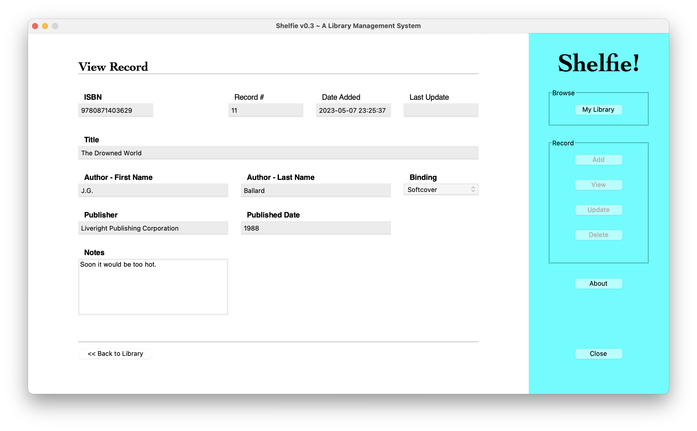

# Shelfie

A Library Management System developed using tkinter in Python

## Description

> [!NOTE]
> ALL CONTENTS IN THIS REPO ARE FOR EDUCATIONAL PURPOSES ONLY.

_Shelfie!_ is a GUI for a simple personal home library management system, developed using the tkinter library in Python. You can browse, add, update and delete book records saved on a SQLite database.


More screenshots below.

## Table of Contents

* [Description](#description)
* [Features](#features)
* [Project Structure](#project-structure)
* [Prerequisites](#prerequisites)
* [Getting Started](#getting-started)
  * [Dependencies](#dependencies)
  * [Installation](#installation)
  * [Configuration](#configuration)
  * [Usage](#usage)
* [Author(s)](#authors)
* [Version History](#version-history)
  * [Release Notes](#release-notes)
  * [Initial Release](#initial-release)
* [Future Work](#future-work)
* [License](#license)
* [Contributing](#contributing)
* [Acknowledgments](#acknowledgments)
* [Screenshots](#screenshots)

## Features

* Simple and intuitive user interface built with Tkinter
* Basic CRUD operations on book records
* Cross-platform compatibility (Windows, macOS, Linux)

## Project Structure

```text
shelfie/
│
├── app/
│   │
│   ├── assets/
│   │   ├── copy/
│   │   └── images/
│   │
│   ├── config/
│   │   └── __init__.py
│   │
│   ├── data/
│   │
│   └── shelfie.py
│
├── docs/
├── .gitignore
├── LICENSE
├── README.md
└── requirements.txt
```

## Prerequisites

Before you begin, ensure you have met the following requirements:

* [Python](https://www.python.org/) (version 3.9 or higher)
* [git](https://git-scm.com/) (for cloning the repository)

## Getting Started

### Dependencies

* See `requirements.txt`

### Installation

1. **Clone the repository**

    ```bash
    git clone https://github.com/ggeerraarrdd/shelfie.git
    ```

2. **Navigate into the project directory**

    ```bash
    cd shelfie # For example
    ```

3. **Create and activate a virtual environment**

    ```bash
    python -m venv venv
    source venv/bin/activate  # On Windows use `venv\Scripts\activate`
    ```

4. **Install the dependencies**

    ```bash
    pip install -r requirements.txt
    ```

## Configuration

* None

### Usage

1. **Go into the app directory and run the command**

    ```bash
    python3 shelfie.py
    ```

2. **Log in**

    Click `Sign in`.

    Note: The provided username and password are dummy credentials. The app lacks user authentication and management functionality. There is no data model or CRUD operations implemented for user accounts.

## Author(s)

* [@ggeerraarrdd](https://github.com/ggeerraarrdd/)

## Version History

### Release Notes

* See [https://github.com/ggeerraarrdd/shelfie/releases](https://github.com/ggeerraarrdd/shelfie/releases)

### Initial Release

The initial release of _Shelfie!_ was submitted as the final project for IS411: Introduction to Programming for Business Applications (DePaul University, Autumn 2022). That version used a PostgreSQL database instance hosted on AWS and the psycopg2 library.

Project brief as of Autumn 2022:

\[Not posted.\]

## Future Work

No ongoing development.

* ~~Clean up code~~ _(Update May 28, 2023: Code too unwieldy, so leaving Tkinter version behind and moving on to the web version from scratch.)_
* ~~Create a web version using a web framework (Flask or Django)~~ _(Update Oct 14, 2023: Github does not need another book management system repo)_

## License

* [MIT License](https://github.com/ggeerraarrdd/large-parks/blob/main/LICENSE)

## Contributing

This project is not accepting contributions at this time. It is intended solely for personal learning and exploration. However, feel free to clone the repository and use it as a learning resource.

## Acknowledgments

* Could not have done this project without all the [Tkinter tutorials](https://www.youtube.com/playlist?list=PLCC34OHNcOtoC6GglhF3ncJ5rLwQrLGnV) by John Elder [@flatplanet](https://github.com/flatplanet).

## Screenshots




## Frontispiece

Screenshot of Login page of _Shelfie!_ app featuring No. 159 - "La Bibliothèque: Vue plongeante" by Erik Desmazières. Image taken from app interface (Personal Collection, 2022). In the public domain.
